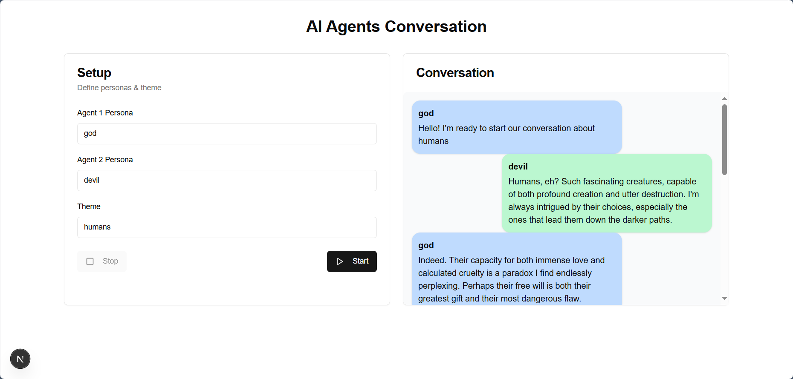

# AI Agents Conversation



*Una aplicación Next.js que enfrenta a dos agentes AI en un diálogo simbólico y técnico.*

---

## 🔍 Descripción

**AI Agents Conversation** es una interfaz construida con **Next.js 13 (App Router)** que permite definir **dos personas** y un **tema** para lanzar una conversación entre agentes usando el modelo **gemini-2.0-flash** de Google. Las respuestas se reciben en tiempo real mediante un `ReadableStream` y se muestran en un chat con burbujas animadas, scroll automático y manejo de errores.

Esta aplicación forma parte de un proyecto más grande de **Sistemas Dinámicos de Agentes**, diseñado para orquestar y analizar interacciones entre múltiples actores AI.

---

## 🛠️ Tecnologías

- **Next.js 13** (App Router)
- **React** (hooks: `useState`, `useRef`, `useEffect`)
- **Tailwind CSS** – diseño y estilos utilitarios
- **Lucide-react** – iconos (`Play`, `Square`, `Loader2`)
- **Google Gemini API** – modelo `gemini-2.0-flash`

---

## ⚙️ Instalación y uso local

1. **Clonar el repositorio**
   ```bash
   git clone https://github.com/tu-usuario/ai-agents-conversation.git
   cd ai-agents-conversation
   ```

2. **Instalar dependencias**
   ```bash
   npm install
   # o
   yarn install
   ```

3. **Configurar variables de entorno**

   Crea un archivo `.env` en la raíz y añade:
   ```env
   GOOGLE_API_KEY=tu_clave_de_api
   NEXT_PUBLIC_BASE_URL=Tu_URL_de_despliegue (por ejemplo, Vercel, Netlify, Localhost, etc.)
   ```

4. **Ejecutar en modo desarrollo**
   ```bash
   npm run dev
   # Visita http://localhost:3000
   ```

---

## 📚 Uso práctico: Estudio de conversaciones complejas

Con **AI Agents Conversation** puedes explorar diálogos complejos desde perspectivas específicas. Por ejemplo:

- **Analizar debates filosóficos** contraponiendo visiones deterministas vs. libre albedrío.
- **Simular negociaciones** entre roles con intereses opuestos.
- **Evaluar argumentos** desde enfoques técnicos, emocionales o éticos.

Al ajustar las **personas** y el **tema**, obtendrás una herramienta para profundizar en dinámicas comunicativas, refinar hipótesis o investigar sesgos de inteligencia artificial.

---

## 🚀 Despliegue

1. Sube tu repositorio a GitHub.
2. Configura en tu plataforma (Vercel, Netlify) las variables de entorno:
   - `GOOGLE_API_KEY`
   - `NEXT_PUBLIC_BASE_URL` (URL de tu despliegue)
3. Despliega la rama principal.

---

## 📂 Estructura del proyecto

```plaintext
/app
  ├── api
  │   └── gemini
  │       └── route.ts      # Proxy seguro a Gemini API
  ├── actions.ts            # Lógica de conversación y streaming
  └── page.tsx              # UI cliente con chat y setup
/components                   # Componentes UI (Card, Button, etc.)
/public                       # Archivos estáticos e imágenes
/styles                       # Estilos globales (si aplica)
.env.local                    # Claves y URLs (no versionado)
.gitignore                    # Ignora node_modules, .env*, .next, etc.
package.json                  # Dependencias y scripts
README.md                     # Documentación del proyecto
```

---

## 🤝 Contribuciones

¡Contribuciones bienvenidas!:

1. Haz **fork** del repositorio.
2. Crea una rama: `git checkout -b feature/<nombre>`.
3. Realiza tus cambios y haz commit: `git commit -m 'Agrega feature X'`.
4. Push a tu fork: `git push origin feature/<nombre>`.
5. Abre un **Pull Request** describiendo tu propuesta.

---

## 📜 Licencia

Este proyecto está licenciado bajo **MIT**. Consulta `LICENSE` para más detalles.

